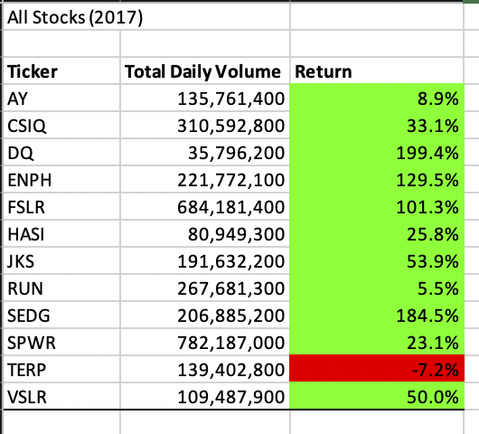
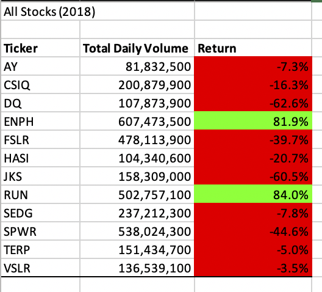
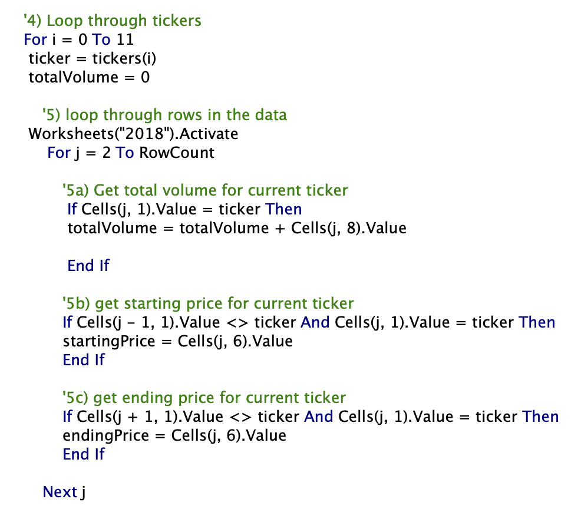
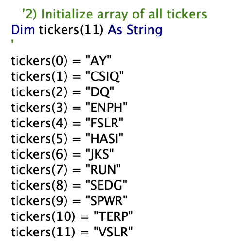
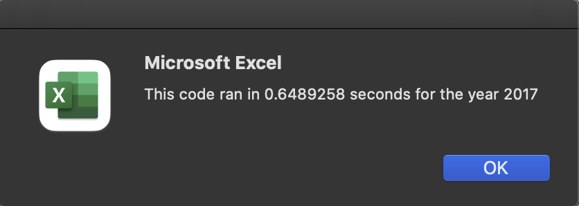
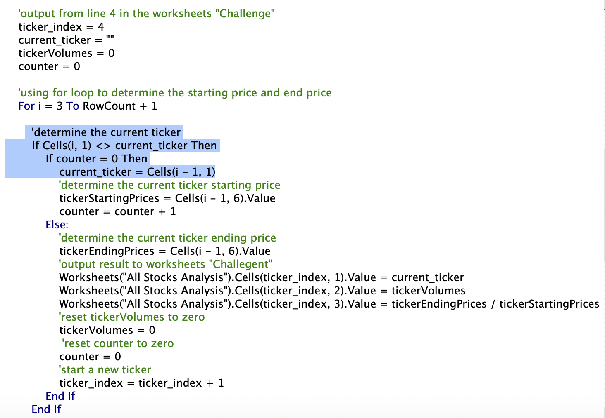
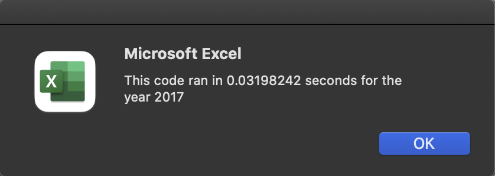
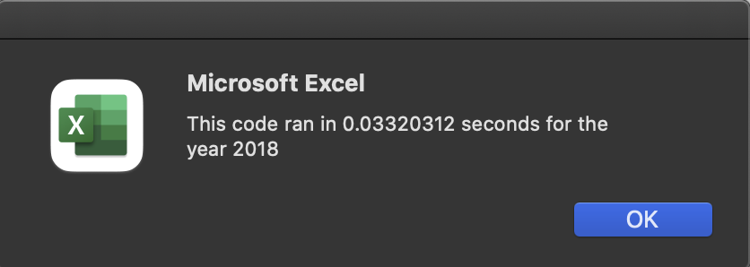

# VBA_stocks-analysis

## Overview of Project
The purpose of this project is to analysis how the stocks market perform in year 2017 and 2018. By refactoring a code works well for a doze  stocks, we can also analyze thousands of stocks in an efficient manner. 

We will compare the performance of two codes by comparing their run time respectively. The shorter the run time, the more efficient the code is. In this project, we are not only knowing the stcok market performance, but also how to refine a code.

## Results
### Stock analysis result
The stock performance in year 2017 is generally better than 2018, nearly all stocks in our data set record a positive return, among them DQ records the highest return which is almost a double, followed by SEDG with a +184.5% increment.  While the stocks market in year 2018 is groomy, only 2 stocks (ENPY and RUN) are in positive return, +81.9% and +84.0% respectively. And they also have +129.5% and +5.5% return respectively in year 2017. Summary tables of stocks performance are showns as below:

### Original script and performance
Now let's shift our angle to discuss how is the code perform in this analysis. In the original script, there's a nested for loop to scan the whole data set for each stock ticker. "for i = 0 to 11" is to loop through the dataset the get tickers, and "for j = 2 to Rowcount" in side this for loop means to loop through the whole data set for one stock ticker. There are 12 tickers means the each row need to be scanned through 12 times. It takes about 0.6 second to execute base on the original script. Even though 0.6 second is not slow, it might not be efficient enough if there are thousands of stocks need to be compared. 

Secondly, we need to create array for each ticker manually, if there are thousands of stocks then we need to create thousands of ticker array. It is not feasible. 

Original script - for loop issue

Original script - tickers array issue

Original execution time for stocks in year 2017

Original execution time for stocks in year 2018

### Refacted script and performance
Is there a way to speed up by eliminating loops? The answer is yes. Since all the stock tickers are sorted, when the computer identified a stock ticker, it can start obtaining its starting price, and accumulating its daily volumn untill it found a new stock ticker appears. Thus, the computer just need to run through the data set once to obtain all the information we want. 

Secondly, instead of creating ticker arrays manually for each stocks, we create a variable called current_ticker indicate which ticker we are doing currently. It is initialised to be empty "" before starting the for loop. Inside the for loop, when the cell the computer is reading is not equal to current_ticker, it must be a new ticker. And then the computer knows to start counting the total ticker volumn and get its starting and ending price to calculate the return. 

After such improvement, the execution time reduced to about 0.03 second. Although the execution time is not exactly the same every time when we run the code, we can see the order of manititue is 10 times difference which is very significant.
That means we achived our goal that we refactored the script in a more efficient way.

Refactored script

## Summary

Refactoring code is very common in work. It can help to save time, memory and money especially for a mass data set. Secondly, code can be easier to read and understand after refactoring. Third, a clean code is easier for updating and improvment. Even there are many advantages of code refactoring, there is still voice on "why do we spend time on refactoring if the original script works?". Refactoring takes time, takes time to first understand the origianl script and then think of a way to improve it if there is any. So time consuming is the main disadvantage of code refactoring. 

In this project, we can see the orginal script is stright forward and easy to understand. It takes less time to construct even for green VBA user. However, it scans the whole date set once for each ticker, which is time consuming especially for mass data set. 

After refactoring, the execution time is significantly faster than the original script. Because we noticed that the data is sorted, it is not necessary to loop through the whole data set for each stock ticker. The computer can stop working for current ticker whenever it finds a new one appears, and then immediatly start working on the new sticker. Besides, we don't need to create array for each stock sticker manually, it is a huge benefit later when we expend the analysis to thousands of different stocks. The computer can capture every stock ticker automatically. 

